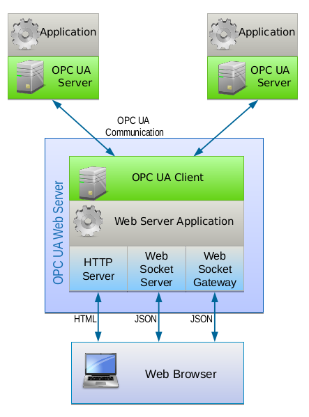

Overview
====================

ASNeG OPC UA Web Server provides a simple way to connect modern Web applications with the
OPC UA technology. Any process data can be displayed in realtime in Web applications using ASNeG OPC UA Web Server. 

Structure of the OPC UA Web Server
-----------------------------------

The OpcUaWebServer contains the following components:

* HTTP Server
* Web Socket Server
* Web Gateway 
* OPC UA Client

   **OpcUaWebServer components**

**HTTP Server** provides a simple interface for web pages. The provision of simple static web
pages in HTML format does not require a separate web server for simple web applications with
:term:`OPC UA` access. The use of the :term:`HTTP Server` component is optional.

**WebSocket Server** provides a :term:`JSON API` via bidirectional :term:`WebSocket` protocol for access to :term:`OPC UA` variables.
The WebSocket Server component is decoupled from the OPC UA server. Symbolic names are used to
access :term:`OPC UA` variables. A configuration in the WebSocket Server maps these variables to :term:`OPC UA`
variables and the assigned :term:`OPC UA` server. The functionality of the interface is very simple but
limited to a few functions. The disadvantage of the interface is the high configuration effort. 
The use of the WebSocket Server component is optional. 

**WebSocket Gateway** provides a :term:`JSON API` via bidirectional WebSocket protocol for access to :term:`OPC UA` server services.
The WebSocket Gateway component is not decoupled from the :term:`OPC UA server`. All web application :term:`JSON`
packets are transferred from the WebGateway to binary :term:`OPC UA` packets and sent directly to the assigned :term:`OPC UA` server. 
A separate configuration for the WebGateway is not necessary. As an advantage,
all :term:`OPC UA` service functions of an :term:`OPC UA` server can be used directly from the web application. However,
the :term:`JSON` interface functions are a little bit complex than with the WebSocket Server model. The use of the Web Gateway component is optional.   

**OPC UA Client** is used for communication with one or more :term:`OPC UA` servers.

In addition, the Web Server provides **Web Panel** for visualization of the process data. **Web Panel** uses a JavaScript library of visual components which can be bound with OPC UA variables. You can use it as a very
simple :term:`SCADA` system configured by XML files. You can see how it work with our `Demo Application`_.

WebSocket Server JSON API Reference
------------------------------------

*WebSocket Server* has a simple :term:`JSON API` with the limited functionality contains the following requests:

+---------------------+----------------------------------------------------------------------+
| Name                | Description                                                          |
+=====================+======================================================================+
| :ref:`valuelist`    | Returns all names of  OPC UA variables processed by the server.      |
+---------------------+----------------------------------------------------------------------+
| :ref:`valueinfo`    | Returns information about OPC UA variables (such as type, name etc.) |
+---------------------+----------------------------------------------------------------------+
| :ref:`read`         | Reads the value, status and timestamp of the given variable          |
+---------------------+----------------------------------------------------------------------+
| :ref:`hisread`      | Reads historical values of the given variables. **Not implemented.** |
+---------------------+----------------------------------------------------------------------+
| :ref:`write`        | Writes the value, status and timestamp of the given variable         |
+---------------------+----------------------------------------------------------------------+
| :ref:`monitoring`   | Subscrubes to the given variable to receive its new values           |
+---------------------+----------------------------------------------------------------------+

For more information see :ref:`websocket_server`

WebSocket Gateway JSON API Reference
------------------------------------

*WebSocket Gateway* supports all the :term:`OPC UA` services that `ASNeG OPC UA Stack`_ covers.
See `its coverage tables <https://opcuastack.readthedocs.io/en/latest/1_getting_started/overview.html#opc-ua-specification-coverage>`_ 
for more information.

References
----------

* `ASNeG OPC UA Stack`_
* `Demo Application`_
* :ref:`websocket_server`
* :ref:`websocket_gateway`

.. _`ASNeG OPC UA Stack`: https://asneg.github.io/projects/opcuastack
.. _`Demo Application`: http://jenkins.asneg.de:8083
